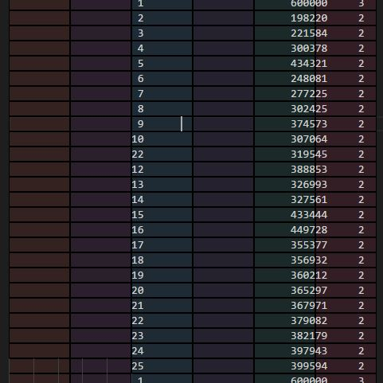
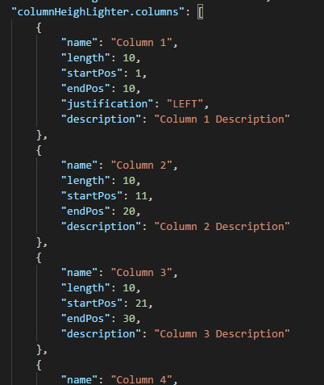

# Column Heighlighter

This extension heighlight column based on your setting.

# Usage
* Ctrl+K, Ctrl+M and change the language to "print".
* You can use multiple language. Add them to user settings `columnHeighLighter.languages`.
* Columns Color can also be changed `columnHeighLighter.colors`
* You need defined the column's boundaries so that the extention. By default it heighlight five column with width of 10. 

# To Develope
* Run `npm install`
* Then `npm run compile`
* Press Ctrl+F5
